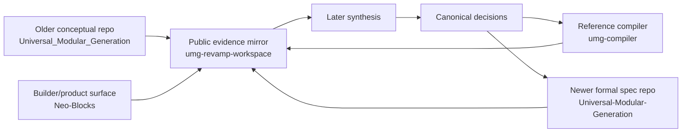
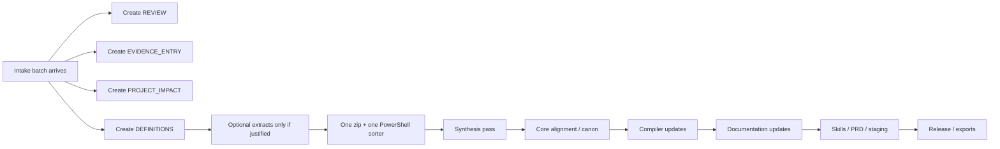
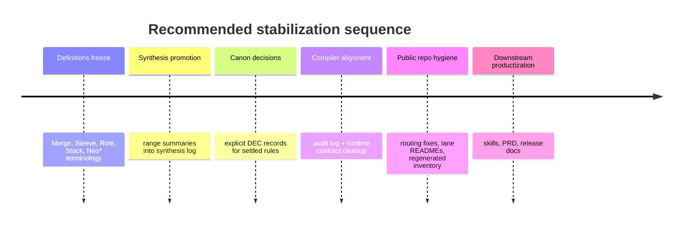

# Analytical Report on NeoMagnetar/umg-revamp-workspace

## Executive summary

`NeoMagnetar/umg-revamp-workspace` is not positioned as the canonical working surface for UMG. It is explicitly a **public mirror** of the local workspace, intended to preserve the existing lane structure, keep files readable in readable paths, support navigation and front-end GPT use, and help OpenClaw-style workflows, while the **local workspace remains the source of truth**. The repo also explicitly warns readers **not** to assume semantic consolidation has already happened, which is a crucial framing rule for any downstream agent or research workflow.  

The mirror is already substantial. The current workspace inventory shows contiguous Stage 1 core batch artifacts from **BATCH-001 through BATCH-209** in the evidence, project-impact, reviewed-batch, and definitions lanes, which implies at least **209 mirrored intake batches** in the core corpus. The strongest populated lanes are intake, compiler/runtime extracts, sleeves, definitions, contradiction tracking, and canon-candidate fragments. By contrast, the later-phase governance artifacts such as the master synthesis log, canonical decisions log, compiler audit log, documentation update log, skill matrix, PRD, and changelog are still mostly templates or stubs rather than filled decision records.         

The single most important analytical finding is that the mirror spans **two doctrinal generations** of UMG at once. The older `NeoMagCustoms/Universal_Modular_Generation` repository, now archived, presents UMG as a MOLT-based cognitive operating system with **Merge included as a canonical MOLT type**. The newer `NeoMagCustoms/Universal-Modular-Generation` repository reframes UMG as a **Cognitive Specification Layer (CSL)** with a specification-first model, clear separation of specification / compilation / execution, and a canonical reference compiler that produces `RuntimeSpec` and `Trace`. Inside the revamp workspace, later intake batches explicitly move toward the newer framing and go further: they remove **Merge as a MOLT type**, treat it as an **operation**, distinguish **role** from **MOLT type**, and harden the compiler pipeline and repo strategy around a cleaner `umg-core` style future. This doctrinal overlap is the main reason the workspace now needs deliberate contradiction resolution, not just more intake. citeturn9view1turn9view0   

The practical recommendation is therefore straightforward. The repo is already rich enough to support serious synthesis, but it is **not yet clean enough** to be treated as a stable public canonical reference. The next priority should be: unify definitions, resolve a small set of high-impact doctrinal contradictions, fix routing drift and navigation hygiene in the mirror, then promote stabilized outputs into the empty later-phase logs and decision records. After that, the public repo becomes much more useful to both front-end GPT and agentic tooling.   

## Purpose and scope

The mirror repository’s own README is unusually explicit about scope. It says the repository exists to mirror the local UMG Revamp Workspace as a **readable public corpus**, preserve the same top-level lanes, keep readable files in readable paths, avoid treating `UNZIPPED FILES` as a primary public knowledge lane, and avoid implying that semantic consolidation is already complete. That means the repo’s job is not “finished canon,” but “publicly navigable evidence and scaffolding.” 

That mirror purpose sits inside a larger repo ecosystem that is itself evolving. The older `Universal_Modular_Generation` repo is archived and presents UMG in a more early-generation MOLT/block-builder style. The newer `Universal-Modular-Generation` repo positions UMG as a **technology-agnostic Cognitive Specification Layer**, stores authoritative material under `/spec`, and explicitly states that the compiler should emit `RuntimeSpec` and `Trace` without executing intelligence. The `umg-compiler` repo then operationalizes that stance as a **headless deterministic compiler**, while `Neo-Blocks` represents a productized builder surface for business plans, web apps, and chatbot outputs on top of modular UMG blocks. The revamp workspace is therefore best understood as the **intake-and-normalization hub** that sits between earlier concept-heavy material and later formal spec / compiler / builder surfaces. citeturn9view1turn9view0  



The diagram above is the structure implied by the repo README, the newer CSL/spec repo, the compiler repo, and the later-stage intake batches that call for a cleaner core repo and stricter doctrinal freeze before implementation scale-up.  citeturn9view0turn9view1  

## Structure and mirrored file map

The public mirror preserves the local workspace’s lane model. The official lane list is defined in the repo README, and the baseline operating pack is mapped in `FILE_DESTINATION_MAP.md`. The best current navigation artifact is `00_ADMIN/status_logs/WORKSPACE_FILE_INVENTORY.txt`, which lists the mirrored file paths currently present in the public repo.   

The table below maps the local top-level lanes to their public repo paths. Counts are exact where the inventory clearly shows contiguous ranges; otherwise they are minimums or qualitative counts based on the visible inventory snapshot.

| Local folder | Repo path | Brief description | File counts if available |
|---|---|---|---|
| `00_ADMIN` | `00_ADMIN/` | Operating pack, roadmap, tracker, handoff notes, status logs | **10** visible files |
| `01_INTAKE` | `01_INTAKE/` | Stage 1 evidence corpus: reviewed batches, evidence entries, project impacts, intake index | **≥629 core files** from `209 reviews + 209 evidence + 209 impact + 2 index files`, plus extra optional artifacts |
| `02_SYNTHESIS` | `02_SYNTHESIS/` | Cross-session summaries and contradiction tracking | Many contradiction files + overview + master log |
| `03_CORE_ALIGNMENT` | `03_CORE_ALIGNMENT/` | Canon candidates and canonical decision scaffolding | Many candidate fragments + overview + decisions log template |
| `04_COMPILER` | `04_COMPILER/` | Compiler extracts, range status, audit scaffolding | Many compiler extracts + status + audit template |
| `05_DOCUMENTATION` | `05_DOCUMENTATION/` | Core definitions, sleeves, blocks/MOLT, NeoBlocks/NeoStacks docs | **≥210** in core definitions/doc files alone, plus many extract files |
| `06_SKILLS` | `06_SKILLS/` | Skill-dependency alignment | **1** visible file |
| `07_PRD_AND_STAGING` | `07_PRD_AND_STAGING/` | PRD scaffold and staging lane | **1** visible file |
| `08_RELEASE` | `08_RELEASE/` | Release scaffold and changelog | **1** visible file |
| `09_EXPORTS` | `09_EXPORTS/` | Export and handoff rules | **1** visible file |
| `10_ARCHIVE` | `10_ARCHIVE/` | Historical lane reserved by structure | No visible files in current inventory |

This structure is consistent with the repo’s declared purpose: keep the lanes intact and readable, while preserving the distinction between evidence, synthesis, core alignment, compiler impact, documentation, skills, staging, release, and exports.   

The most important anchor files for any human or agent entering the repo are these:

| File | Why it matters |
|---|---|
| `README.md` | Declares the public-mirror rule and lane list |
| `00_ADMIN/project_overview/FILE_DESTINATION_MAP.md` | Defines where baseline files belong |
| `00_ADMIN/project_overview/PROJECT_SYSTEM_INSTRUCTIONS.md` | Defines operating rules and execution order |
| `01_INTAKE/intake_index/INTAKE_REVIEW_STANDARD.md` | Defines per-batch output shape |
| `00_ADMIN/session_notes/NEXT_INTAKE_GPT_HANDOFF_001_025.md` | Preserves intake-mode discipline |
| `02_SYNTHESIS/cross_session_summaries/INTAKE_RANGE_SUMMARY_BATCHES_001_025.md` | Gives the strongest cross-batch themes |
| `00_ADMIN/status_logs/WORKSPACE_FILE_INVENTORY.txt` | Shows what is actually mirrored now |

Those files together answer the most important onboarding questions: what the repo is, how work is routed, what a valid intake artifact looks like, how evidence differs from canon, and what is actually present in the public mirror today.       

## Concepts, workflow, and rules

The recurring terms in the corpus are not static. They form a moving vocabulary that must be normalized before the repo can become a firm public reference. The table below summarizes the most important terms and where the tensions are.

| Term | Working definition in the corpus | Key references | Immediate unification issue |
|---|---|---|---|
| **MOLT** | Early repo: “Modular Operating Language of Thought,” with typed cognitive blocks and an authority hierarchy; later corpus: still the typed ordering grammar, but later canon work removes `Merge` as a MOLT type and treats it as an operation | Older repo README; new spec repo; BATCH-003 MOLT extract; BATCH-175/BATCH-195 | Decide whether public canon follows the older 9-type taxonomy or the later 8-type taxonomy with `Merge` moved out of type-space |
| **Sleeve** | Early intake: top-level runtime identity; later CSL/compiler work: static, non-executable, agent-ready cognitive loadout holding blocks, stacks/modules, defaults, and metadata | BATCH-001 definitions and sleeve extract; BATCH-195 | Separate **authoring-layer sleeve** from **active runtime sleeve / displayed runtime identity** |
| **Compiler** | Early intake: minimal translator that validates and emits normalized runtime spec; later canon: deterministic interpreter of CSL that outputs `RuntimeSpec + Trace` through an explicit pipeline | BATCH-001 compiler extract; `umg-compiler` README; BATCH-175/BATCH-195 | Decide which scope is current public truth: early minimal translator, or later deterministic compiler-v0 contract |
| **NeoBlocks / NeoStacks** | Composable internal structures: NeoBlocks are specialized subfunctions; NeoStacks are grouped cognitive families or dimensions | `umg-compiler` README; BATCH-003 neostructure extract | Decide whether Neo* terms are canonical external vocabulary or internal / alias terminology |
| **Bundle / Merge** | Later candidate-overview work treats Bundle as an ordered grouping and Merge as a rarer synthesis/operation; later CSL work treats structural merge as same-type-only compiler logic | Canon-candidate overview; contradiction overview; BATCH-175/BATCH-195 | Formalize bundle/merge/precedence doctrine and remove legacy ambiguity |

The most load-bearing contradiction is easy to name. The archived older repo still presents **Merge** as a canonical MOLT type, while the later canon-founding batches explicitly remove Merge from the MOLT type set and relocate it into the operation layer. That is not a cosmetic wording difference. It affects typing, compiler ordering, trace logic, and glossary governance. citeturn9view1  

The second major tension is the meaning of **sleeve**. Early intake material frames sleeve as active runtime identity and resleeving as the visible activation loop. Later CSL/compiler material reframes sleeve as a **static non-executable container** and moves active truth to compiled/runtime artifacts like `RuntimeSpec`, `Trace`, and visible active-stack/active-sleeve state. This looks less like a fatal contradiction than a missing distinction between **specification sleeve** and **runtime activation state**, but it is still important enough to require cleanup.   

The third concept that has clearly matured is the **compiler**. BATCH-001 preserves a deliberately modest “translator-first” scope: read sleeve source, validate required fields, emit normalized runtime spec, and defer deeper MOLT-aware parsing, merge logic, NeoBlock generation, and richer synthesis. By BATCH-175 and BATCH-195, the compiler is described as a deterministic interpreter of CSL with a fuller pipeline, explicit artifacts, stable authority ordering, same-type merge rules, strict trace semantics, and public repo / documentation consequences. This looks like a staged maturation path rather than a direct contradiction, but public-facing docs must say **which maturity level is current**.    

The workspace workflow itself is much steadier than the terminology. `PROJECT_SYSTEM_INSTRUCTIONS.md` and the roadmap say the ordered path is: stabilize semantics first, then map semantic decisions into compiler impact, update documentation, align skills, rebuild PRD/staging, stage GitHub execution, verify release readiness, and only then expand blocks and sleeves at scale. The intake handoff and workflow-status files reinforce that Stage 1 is intentionally narrow: treat all sources as **evidence, not canon**; produce the default four files; add optionals only when justified; generate one zip handoff and one PowerShell sorter block per coherent batch; and do not silently drift into synthesis or PRD writing during intake.    



That flow is not just conceptual; the workflow-status file also defines the routing rules. `*_REVIEW.md` goes to `01_INTAKE/reviewed_batches`, `*_EVIDENCE_ENTRY.md` to `01_INTAKE/pending_evidence_entries`, `*_PROJECT_IMPACT.md` to `01_INTAKE/pending_impact_maps`, `*_DEFINITIONS.md` to `05_DOCUMENTATION/core_definitions/intake_definitions`, and optional extracts route into compiler, sleeves, blocks-and-MOLT, neostructure, contradiction, and canon-candidate lanes. Those routing rules matter because the current public mirror already shows signs of routing drift. 

## Current state, gaps, and risks

The mirror is already strong as an **evidence lake**. The range summary for BATCH-001 through BATCH-025 identifies the strongest recurring themes as semantic stabilization, compiler/runtime control, sleeve/runtime identity, output-envelope separation, deployment/packaging, and staging discipline. The range compiler-status file then says compiler/runtime pressure is **high**, and the sleeve-status file says sleeve pressure is **high**. The contradiction overview says contradiction pressure is **medium**, but mostly in the form of doctrinal refinement and unresolved placement decisions rather than direct factual collision. The canon-candidate overview says canon-candidate pressure is **high**, which is exactly what you would expect from a corpus that has accumulated faster than it has been normalized.     

The mirror is weaker as a **canonical reference site**. The master synthesis log is still a template, the canonical decisions log is still an empty template, the compiler audit log is still an empty template, the documentation update log is only a stub, the skill matrix still contains example placeholder rows, and the PRD and changelog are still templates rather than filled project records. That means the repo’s heavy evidence accumulation is not yet matched by equally strong downstream decision capture.       

The most immediate operational risk is **repo hygiene drift**. The routing rules say `*_CANON_CANDIDATES.md` should land in `03_CORE_ALIGNMENT/candidate_fragments` and `*_COMPILER_EXTRACT.md` should land in `04_COMPILER/intake_extracts`, but the current inventory also shows examples of optional files such as `BATCH-154_CANON_CANDIDATES.md` and `BATCH-154_COMPILER_EXTRACT.md` appearing under `01_INTAKE/reviewed_batches`. That means at least some artifacts are being mirrored or stored in non-canonical public locations, which will confuse both retrieval and downstream automation.  

A second risk is **public evidence being mistaken for canon**. The repo itself says not to assume consolidation has happened, the range summary says the material remains evidence rather than canon, and the canon-candidate overview explicitly warns that even strong recurring lines remain candidate language until promoted. Any front-end GPT or research agent that reads the mirror without those guardrails could accidentally cite Stage 1 evidence as settled doctrine.   

A third risk is **public-noise handling**. The README makes a good call by explicitly saying not to treat `UNZIPPED FILES` as a primary public knowledge lane. That is exactly right. Public navigation is improved by readable markdown and structured folders, not by raw unzip dropzones, downloaded archives, or opaque batch-transfer clutter. The public map should continue to exclude or quarantine raw unzip lanes and similarly noisy binary export lanes unless there is a strong public reason to expose them.  

A fourth risk is **navigability at scale**. `WORKSPACE_FILE_INVENTORY.txt` is useful, but once a mirror reaches 200+ batches, a flat inventory alone is not enough. Agents and humans both need better local navigation aids such as lane READMEs, per-folder indices, and one or two public “you are here” documents that distinguish evidence lanes from canon lanes. Without that, the repo remains machine-readable but not yet decision-friendly.  

## Prioritized focus areas and agent-ready execution

The revamp workspace now has enough material to justify a narrow set of high-leverage normalization tasks. The first priority should be **definitions unification**, centered on five questions that recur across the mirror: whether Merge is a type or an operation; whether sleeve means runtime identity, static loadout, or both at different layers; how role differs from MOLT type; how Stack differs from Module or organizational grouping; and whether Neo* terms are canonical, internal, or aliased vocabulary. Those are the points where the corpus carries the most load-bearing contradiction pressure.    

The second priority should be **promotion of range-level synthesis into canonical records**. The workspace already contains range summaries, contradiction overviews, compiler-status summaries, sleeve-status summaries, and canon-candidate overviews. The missing move is to turn those into actual entries in `MASTER_SYNTHESIS_LOG.md`, `CANONICAL_DECISIONS_LOG.md`, `COMPILER_AUDIT_LOG.md`, and `DOC_UPDATE_LOG.md`. Until that happens, the repo remains rich in raw signal but weak in final judgments.         

The third priority should be **repo hygiene and public navigation**. That means correcting misrouted files, regenerating inventory after each sync, adding lane READMEs or `INDEX.md` files in deep/high-volume folders, and preserving the public-safe mirror rule that excludes `UNZIPPED FILES` and other raw/noisy transfer surfaces from the main reading experience.   



The sequence above is the one most consistent with the repo’s own execution-order documents: stabilize semantics first, then compiler and documentation, then skill alignment, then PRD/staging, then release.  

A concrete agent task list follows.

| Priority | Agent-ready task | Exact target | Why it matters |
|---|---|---|---|
| P0 | Create one normalization memo for `Merge`, `Bundle`, `Role`, `MOLT type`, `Sleeve`, `Stack`, `Module`, `Neo*` | `02_SYNTHESIS/` then `03_CORE_ALIGNMENT/` | Resolves the highest-value doctrinal drift first |
| P0 | Populate first real decision records | `03_CORE_ALIGNMENT/canonical_decisions/CANONICAL_DECISIONS_LOG.md` | Converts evidence into traceable canon |
| P0 | Populate first compiler audit entries | `04_COMPILER/audit/COMPILER_AUDIT_LOG.md` | Converts compiler extracts into implementation-facing checkpoints |
| P1 | Fix misrouted optional artifacts in `reviewed_batches` | move to compiler / candidate / synthesis lanes per routing rules | Makes retrieval and public understanding more accurate |
| P1 | Add public navigation files | `README.md` or `INDEX.md` inside high-volume lanes like `01_INTAKE`, `04_COMPILER`, `05_DOCUMENTATION` | Makes the repo usable by front-end GPT and humans |
| P1 | Regenerate machine inventory after every mirror push | `00_ADMIN/status_logs/WORKSPACE_FILE_INVENTORY.txt` | Keeps the public mirror self-describing |
| P2 | Decide public treatment of binary/noisy lanes | `09_EXPORTS/pdf`, `09_EXPORTS/zip`, `10_ARCHIVE/downloaded_zips`, raw unzip surfaces | Preserves readability and public hygiene |
| P2 | Start promoting stable wording into skills, PRD, and release docs | `06_SKILLS`, `07_PRD_AND_STAGING`, `08_RELEASE` | Completes the roadmap after doctrine is stable |

A recommended public mapping for the repo is below.

| Local folder or lane | Suggested public repo mapping | Recommendation |
|---|---|---|
| `00_ADMIN` | same path | Keep fully mirrored |
| `01_INTAKE` | same path | Keep text artifacts; add navigation docs |
| `02_SYNTHESIS` | same path | Keep; promote overview docs and contradiction tracking |
| `03_CORE_ALIGNMENT` | same path | Keep; make this the visible canon-promotion lane |
| `04_COMPILER` | same path | Keep; add clearer status/readme docs |
| `05_DOCUMENTATION` | same path | Keep; this is the main public explanation lane |
| `06_SKILLS` | same path | Keep, but fill with real skill rows |
| `07_PRD_AND_STAGING` | same path | Keep, but treat as downstream of semantics |
| `08_RELEASE` | same path | Keep, but fill only after canon/doc locks |
| `09_EXPORTS/json|markdown|txt` | same path | Keep if readable and useful |
| `09_EXPORTS/pdf|zip` | same or exclude | Prefer metadata/readme over binary bulk unless needed |
| `10_ARCHIVE` | same path | Keep text-only summaries; avoid public raw dumps where possible |
| `UNZIPPED FILES` | **do not mirror as a primary public lane** | Keep private or summarize under archive/admin, not as a live public corpus |

That mapping follows the repo’s own mirror rule: preserve readable paths, do not elevate unzip-drop noise, and avoid mixing raw intake and finalized canonical material in confusing ways.  

### Preferred PowerShell and Git sync sequence

The safest public-mirror workflow is: clone or update the repo locally, preview a mirror copy with `robocopy /L`, execute the mirror copy with readable-file exclusions if desired, regenerate the inventory file, then `git add`, `commit`, and `push`. The command-line authentication method is **unspecified** in the prompt, so this assumes Git credentials or GitHub CLI auth are already configured on the machine. citeturn6search0turn7search0turn8search0

```powershell
$WorkspaceRoot = "$env:USERPROFILE\Desktop\UMG_Revamp_Workspace"
$RepoRoot = "$env:USERPROFILE\Desktop\umg-revamp-workspace"
$RepoUrl = "https://github.com/NeoMagnetar/umg-revamp-workspace.git"
$Branch = "main"

if (-not (Test-Path $RepoRoot)) {
 git clone $RepoUrl $RepoRoot
} else {
 Set-Location $RepoRoot
 git checkout $Branch
 git pull origin $Branch
}

# Preview-only mirror run.
# Remove /L when you are satisfied with the preview.
$PreviewLog = Join-Path $RepoRoot "robocopy-preview.log"

robocopy $WorkspaceRoot $RepoRoot /MIR /L `
 /XD ".git" "UNZIPPED FILES" "10_ARCHIVE\downloaded_zips" "09_EXPORTS\zip" "09_EXPORTS\pdf" `
 /XF "*.zip" "*.pdf" "Thumbs.db" `
 /R:2 /W:2 /NP /LOG:$PreviewLog
```

The preview run uses `robocopy`’s documented `/MIR` behavior to mirror the source tree, and `/L` makes it a dry-run listing only. The exclusion list keeps `.git` intact and avoids the noisiest public-unfriendly lanes; if you truly want binary-perfect mirroring, remove the `pdf` / `zip` exclusions. citeturn7search0turn6search0

```powershell
$WorkspaceRoot = "$env:USERPROFILE\Desktop\UMG_Revamp_Workspace"
$RepoRoot = "$env:USERPROFILE\Desktop\umg-revamp-workspace"
$Branch = "main"

Set-Location $RepoRoot

# Execute the mirror for readable/public-safe content.
$RunLog = Join-Path $RepoRoot "robocopy-run.log"

robocopy $WorkspaceRoot $RepoRoot /MIR `
 /XD ".git" "UNZIPPED FILES" "10_ARCHIVE\downloaded_zips" "09_EXPORTS\zip" "09_EXPORTS\pdf" `
 /XF "*.zip" "*.pdf" "Thumbs.db" `
 /R:2 /W:2 /NP /LOG:$RunLog

# Rebuild the inventory file after the mirror sync.
$InventoryPath = Join-Path $RepoRoot "00_ADMIN\status_logs\WORKSPACE_FILE_INVENTORY.txt"

Get-ChildItem -Path $RepoRoot -Recurse -File -Force |
 Where-Object {
 $_.FullName -notmatch '\\\.git\\' -and
 $_.FullName -notmatch '\\UNZIPPED FILES\\'
 } |
 ForEach-Object {
 $_.FullName.Substring($RepoRoot.Length + 1)
 } |
 Sort-Object |
 Set-Content -Path $InventoryPath -Encoding utf8

git status --short
git add -A
git commit -m "Mirror workspace snapshot $(Get-Date -Format 'yyyy-MM-dd HH:mm')"
git push origin $Branch
```

This sequence follows the documented local-to-remote GitHub flow—stage files, commit them, and push to the configured remote—and uses the documented Windows `robocopy` mirror semantics for preserving relative paths during a repo working-tree update. citeturn6search0turn7search0turn8search0

## Verification, validation, and intake handoff

A successful transfer should be checked in three layers. First, the repo working tree should contain the files you expect and exclude the lanes you intentionally left out. Second, the regenerated inventory file should reflect the new mirror state. Third, Git should show a clean working tree after commit and the correct remote URL before and after push. That is the minimum reliable post-transfer discipline for a repo whose purpose is readability, not just raw storage.   citeturn6search0turn7search0

A concise verification checklist:

- `README.md` still states that the repo is a public mirror and the local workspace is canonical.
- `00_ADMIN/project_overview/FILE_DESTINATION_MAP.md` and `PROJECT_SYSTEM_INSTRUCTIONS.md` are present.
- `00_ADMIN/status_logs/WORKSPACE_FILE_INVENTORY.txt` was regenerated after the sync.
- No unexpected public `UNZIPPED FILES` tree was mirrored.
- `git status --short` is empty after commit.
- `git remote -v` points to `NeoMagnetar/umg-revamp-workspace`.
- The highest mirrored batch number is what you expect.
- Optional files are located in their documented destination lanes rather than mixed into `reviewed_batches`.    

The script below compares the local readable corpus against the repo working tree, ignoring `.git`, `UNZIPPED FILES`, and binary-heavy exclusions.

```powershell
$WorkspaceRoot = "$env:USERPROFILE\Desktop\UMG_Revamp_Workspace"
$RepoRoot = "$env:USERPROFILE\Desktop\umg-revamp-workspace"

function Get-NormalizedReadableList {
 param([string]$Root)

 Get-ChildItem -Path $Root -Recurse -File -Force |
 Where-Object {
 $_.FullName -notmatch '\\\.git\\' -and
 $_.FullName -notmatch '\\UNZIPPED FILES\\' -and
 $_.FullName -notmatch '\\10_ARCHIVE\\downloaded_zips\\' -and
 $_.FullName -notmatch '\\09_EXPORTS\\zip\\' -and
 $_.FullName -notmatch '\\09_EXPORTS\\pdf\\' -and
 $_.Extension -notin '.zip', '.pdf'
 } |
 ForEach-Object {
 ($_.FullName.Substring($Root.Length + 1)) -replace '\\','/'
 } |
 Sort-Object -Unique
}

$LocalReadable = Get-NormalizedReadableList -Root $WorkspaceRoot
$RepoReadable = Get-NormalizedReadableList -Root $RepoRoot

$Diff = Compare-Object $LocalReadable $RepoReadable

if (-not $Diff) {
 Write-Host "MATCH: local readable corpus and repo working tree align." -ForegroundColor Green
} else {
 Write-Host "DIFF FOUND: investigate the items below." -ForegroundColor Yellow
 $Diff | Format-Table -AutoSize
}

$Required = @(
 "README.md",
 "00_ADMIN/project_overview/FILE_DESTINATION_MAP.md",
 "00_ADMIN/project_overview/PROJECT_SYSTEM_INSTRUCTIONS.md",
 "01_INTAKE/intake_index/INTAKE_REVIEW_STANDARD.md",
 "02_SYNTHESIS/cross_session_summaries/MASTER_SYNTHESIS_LOG.md",
 "03_CORE_ALIGNMENT/canonical_decisions/CANONICAL_DECISIONS_LOG.md",
 "04_COMPILER/audit/COMPILER_AUDIT_LOG.md",
 "05_DOCUMENTATION/release_docs/DOC_UPDATE_LOG.md",
 "06_SKILLS/skill_alignment_matrix/SKILL_ALIGNMENT_MATRIX.md",
 "07_PRD_AND_STAGING/final_prd/PRD_UMG_REVAMP_TEMPLATE.md",
 "08_RELEASE/changelog/CHANGELOG_TEMPLATE.md",
 "09_EXPORTS/handoff_packages/HANDOFF_PACK_EXPORT_RULES.md"
)

$Missing = $Required | Where-Object { -not (Test-Path (Join-Path $RepoRoot $_)) }

if ($Missing.Count -eq 0) {
 Write-Host "REQUIRED FILES: all present." -ForegroundColor Green
} else {
 Write-Host "REQUIRED FILES MISSING:" -ForegroundColor Red
 $Missing
}

Set-Location $RepoRoot
git status --short
git remote -v
git rev-parse --abbrev-ref HEAD
```

The expected output is: a green `MATCH` line, a green `REQUIRED FILES: all present.`, an empty `git status --short`, an `origin` remote pointing at `NeoMagnetar/umg-revamp-workspace`, and the branch name `main` unless you intentionally changed it. If the compare step reports differences, those are the files that need to be copied, excluded, or re-routed before you push. citeturn6search0turn7search0turn8search0

A brief handoff note for any future intake GPT is below.

> Read `README.md`, `FILE_DESTINATION_MAP.md`, `PROJECT_SYSTEM_INSTRUCTIONS.md`, `INTAKE_REVIEW_STANDARD.md`, the latest range summary, the latest contradiction/canon-candidate overviews, and `WORKSPACE_FILE_INVENTORY.txt` first. Treat this repo as a **public evidence mirror**, not settled canon. If intake resumes and the current inventory remains authoritative, the mirrored corpus appears to run through **BATCH-209**, so the next open batch number would be **BATCH-210**. Do not renumber prior work. Stay in Stage 1 evidence mode unless explicitly told to switch into synthesis or canon-promotion mode. Keep the default four files, add optionals only when justified, and preserve the documented routing rules.       
